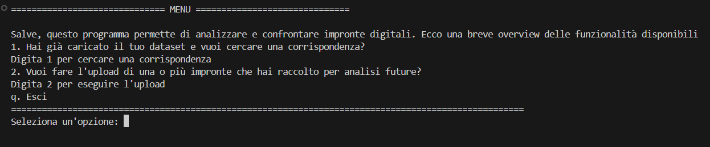
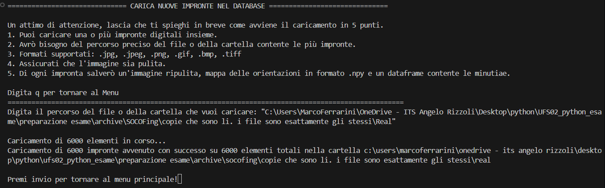
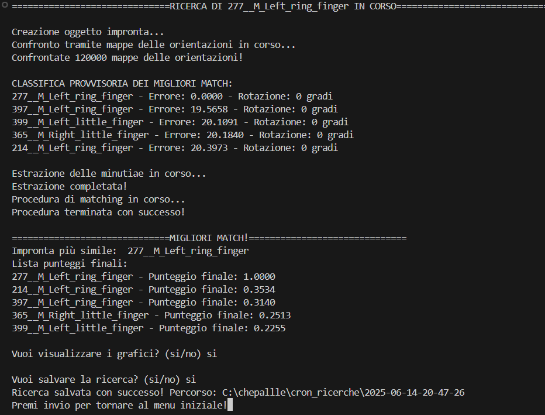
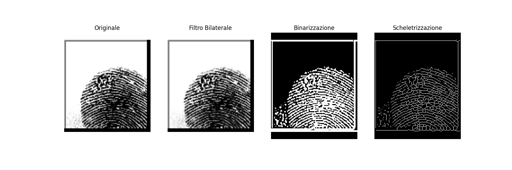
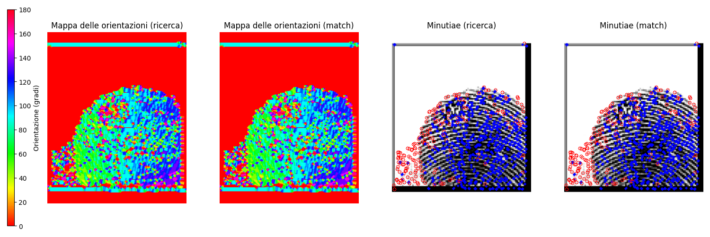

# Sistema di Riconoscimento di Impronte Digitali


> Tags: `fingerprint-analysis` `opencv` `forensics` `image-processing` `python` `student-project`


Sistema per l’identificazione di impronte digitali, realizzato in Python con tecniche di computer vision, mappe di orientamento e rilevamento delle minutiae.

---

## Obiettivi del Progetto

Questo progetto è stato sviluppato come prova finale per l’esame *Python Programming* e costituisce un esercizio completo nell’ambito dell’elaborazione di immagini e dell’analisi biometrica. Il sistema permette di caricare, elaborare, archiviare e confrontare impronte digitali in modo automatico, affrontando sfide reali legate a rotazione, rumore e qualità delle immagini.

---
## Struttura repository

```
fingerprint-recognition/
├── README.md
├── requirements.txt
├── .gitignore
├── presentation.pdf
├── documentation.pdf
├── src/
│   ├── main.py
│   ├── core.py
│   ├── ui.py
│   └── storage.py
├── data/
│   ├── sample_data/
│   └── README.md
└── examples/
```

## Architettura del Sistema

Struttura modulare in 4 componenti principali:

```
src/
├── main.py      # Entry point del programma
├── core.py      # Algoritmi principali per elaborazione e confronto
├── ui.py        # Interfaccia utente a riga di comando
└── storage.py   # Gestione dati e persistenza
```

### Directory di Output

```
orientationmaps/   # Mappe di orientamento (.npy)
minutiae/          # Coordinate delle minutiae (.csv)
cron_upload/       # Impronte elaborate (.bmp)
cron_ricerche/     # Risultati delle ricerche (con timestamp)
```

---

## Funzionalità Principali

- **Doppia Analisi**: Mappa di orientamento + minutiae
- **Compensazione di Rotazione**: Test automatico in un intervallo configurabile (default ±15°)
- **Interfaccia CLI**: Uso semplificato via terminale
- **Visualizzazione**: Diagrammi e immagini dei passaggi di elaborazione e del matching
- **Persistenza e Cronologia**: Tutti i risultati vengono salvati e ordinati temporalmente
- **Tolleranza al Rumore**: Ottimizzato per impronte anche danneggiate o di bassa qualità

---

## Algoritmi Implementati

### Preprocessing
1. **Ridimensionamento** a 241×298 px
2. **Filtro bilaterale** per ridurre il rumore
3. **Binarizzazione adattiva** (gaussiana)
4. **Scheletrizzazione** con `skimage.morphology.thin`

### Estrazione Caratteristiche
- **Minutiae**:
  - Terminazioni: 1 pixel vicino
  - Biforcazioni: ≥3 pixel vicini
- **Mappa di Orientamento**:
  - Gradiente con operatori di Sobel
  - Direzione dominante in ogni cella

### Matching -- [diagramma di flusso](https://kroki.io/mermaid/svg/eNqNlVtu2zgUht-zCo4Lwy3KoLYuluOkHUhsCwzQTIuk6ItgGLRE20RkUiDpNBMnO-ouurHhTZZkdAYVDEPk-c5P8uchNRweKKNqDg5nAIzUluzIaA5GJRZ3I3js-oYFxauKyJEDgSOueWloJfYEut4VLu42gu9ZaVRejO0z8sFa0B0W_yBeceHDUTlbn4S_kgfVImv7nCAZFyURXZ3VuIUqykgbi9ZFuE6amCQFZ2VvEmESJdExWRGhaC8-IUESkJEOP1tD1hX_XmyxUK0XW7WrPuEVqWTfjWIv7q2dKyyptBJnz8_D4dnZUQR8urHsrdKNl_lfjD5SvngFzs_fgY-Ulde4lvlavywl3dEKi-VO9yxsThO3cDo5DL4QAfiGUbCmFQGUXa3EOy4oYQorypnJHDzb1HTikoI2ycCCK6zHZ6TBAoeFhwERggsCrgy2o2zp2n82YGjAp9ufP55AGuXpZkO5YLgPL7ro31yTgeuJ_GQ6Yz7pxRFNTDrTbfri_CuvQQz0emoCrC_UaTs4tnI3ei2KfHhQAhcqF7a1JK7p6B5hc7JTE80CKAPKjOeXmjnrMm2dFdV2GeqPt2DcuJEFrRtZmN_sNQeIrgx-31iyf6TeDw8bP7IoR_qkFRh4wsAlBuj2m2dDN3ac3-Lq_oj5YOSDrhX7FXUm7Q3Mpvl7rPBHgXduBNoXchlTl0-kusaq2OYr_aaLT78uDa1PSTNug9gE9BsWImchOqk-NwkM9FHYENWwrgRR-Gu2wKykJVa8wZ1DKDoMSioVZo8YXAHV7AyK2p1B8WGgaE3BfrPHFT1BzH6g0PXEnaRpbj0gErx-ayaiFfiyJpIvuqzNTv4LfRN4eOrX5lpJrxV2dgwFHS-avpkulqrglS2pes8UMadOe85w5bcGzfyedGxv0i_yz6LULKiJ6Cl0igBd2PwPrHyZm7TFqzY2HOpLS5882ygqLOV7sga14AWR0ux8NX8xDpJkVUKpK_-OzP09DQtzt8791X7Zzy9JQaU-Ul4gimM8jY4CyexifFH8r4A0F6mecDMD-4k5CrivQV_AB8-_01Jt50H9cNku0sq6yxka0Ua9M-jxGoa9-wQejwVMI5jGMAthFsFMv0wh0r8EohnUBnvHuorpBKYBTHXCBGYBRBOI9H8IUQR1fTUWXf4LYiZDyQ)
- **Fase 1: Mappa di Orientamento**
  - Differenza media + rotazione
  - Selezione dei 5 migliori candidati
- **Fase 2: Minutiae**
  - Distanza euclidea
  - Pesi maggiori a match dello stesso tipo
  - Score combinato: 60% minutiae, 40% orientamento

---

## Classi e Moduli

### `fingerprint` (in `core.py`)
Gestisce l’intera pipeline di elaborazione:

- `resize()`, `polish()`, `find_minutiae()`, `gen_orientation_map()` → elaborazione impronta
- `lay()` → Pipeline completa
- `rotate_fp(degrees)` → Rotazione immagini
- `visual_steps()` → Debug visivo

### `search` (in `core.py`)
Gestisce confronto e scoring:

- `find_similar_maps()` → Confronto di mappe delle orientazioni su tutte le impronte caricate (n_impronte_in_memoria * gradi rotazione *2 / larghezza step)
- `rotate_extract()` → Estrazione minutiae dalle 5 impronte più simili
- `best_match_minutiae()` → Score combinato
- `visual_match()` → Visualizzazione finale

### `storage.py`
- `upload()`, `save_search()`, `check_db()`

### `ui.py`
- Menu CLI, parametri, visualizzazioni, interazione utente

---

## Competenze Sviluppate

- **Computer Vision**: OpenCV, morfologia matematica, gradienti, filtri
- **Elaborazione Immagini**: Preprocessing avanzato, riduzione del rumore
- **Analisi Biometrica**: Minutiae detection e mappa di orientamento
- **Architettura Software**: Progetto modulare, persistenza dati, interfaccia CLI
- **Problem Solving**: Gestione rotazione, variazioni di qualità, ottimizzazione runtime

---

## Dataset Utilizzato

- **Fonte**: [SOCOFing](https://www.kaggle.com/datasets/ruizgara/socofing)
- **Dimensione**: 6.000 immagini originali + 49.270 "danneggiate" divise in 3 livelli (easy, medium, hard) per testing
- **Metadati**: Sesso, mano, dito, tipo di alterazione se alterate
- **Formato**: Normalizzato a 241x298px

---

## Risultati

- **Gestione Rotazioni**: Matching stabile
- **Precisione**: Elevata grazie al doppio filtro (orientamento → minutiae)
- **Performance**: Bilanciamento tra accuratezza e tempo di esecuzione
- **Accuratezza**: non sono stati rilevati errori nell'identificazione di impronte con il dataset usato. L'accuratezza può essere influenzata dalla qualità delle immagini

---

## Utilizzo del Software

```bash
# Avvio
python src/main.py

# Scelte disponibili:
# 1. Ricerca corrispondenze
# 2. Upload nuove impronte
# q. Uscita
```

### Parametri configurabili:
- Gradi massimi di rotazione
- Step di rotazione
- Opzioni di visualizzazione output
- Salvataggio grafici in output

---

## Screenshot

### 1. Menu principale


### 2. Caricamento nuove impronte nel database


### 3. Ricerca di un'impronta tramite path


## 4. Step elaborazione impronta


## 5. Grafici in output


---

## Requisiti

- Python ≥ 3.8
- Librerie: `opencv-python`, `numpy`, `pandas`, `matplotlib`, `scikit-image`

```bash
# Clonazione e installazione
git clone https://github.com/yourusername/fingerprint-recognition.git
cd fingerprint-recognition
pip install -r requirements.txt
```

---

## Limitazioni

- Sensibile alla qualità dell’immagine, ma tollerante a danni parziali
- Non utilizza tecniche di deep learning
- Matching ottimizzato su immagini complete

---
## Possibili implementazioni future
- Architettura neurale auto-encoder per la ricostruzione di impronte danneggiate


## Conclusioni

Questo progetto rappresenta una dimostrazione concreta delle mie competenze in:

- **Programmazione Python**
- **Elaborazione di immagini**
- **Design modulare**
- **Gestione file e strutture dati**
- **Progettazione di sistemi biometrici reali**


